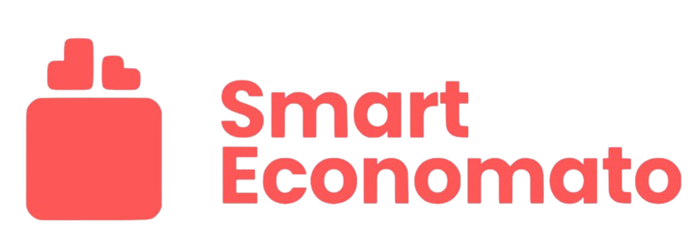

  
  
  

## Características Principales

### Gestión de Inventario y Almacén
- **Registro Unificado:** Control total de ingredientes y materiales no alimentarios.
- **Escaneo de Código de Barras:** Integración para el registro rápido de productos durante la entrada de mercancía.
- **Alertas de Stock:** Dashboard con avisos automáticos de productos bajo mínimos o próximos a caducar.

### Recepción de Pedidos con Pesaje Real
- **Integración con Hardware:** Conexión directa con básculas físicas mediante **Web Serial API**.
- **Validación en Tiempo Real:** Comunicación mediante **Socket.io** para mostrar el peso exacto mientras se recibe el pedido, asegurando que lo que llega coincide con lo pedido.

### Recetario y Escandallo
- **Fichas Técnicas:** Creación de recetas detalladas con gestión automática de alérgenos.
- **Cálculo de Costes:** Generación automática del escandallo basado en el precio actual de los ingredientes en el inventario.
- **Exportación:** Generación de fichas de receta en PDF.

### Seguridad y Roles
- **RBAC (Role-Based Access Control):** Interfaz adaptativa según el rol del usuario (Admin, Alumno, Profesor).
- **Auditoría:** Sistema de logs para trazar todos los movimientos críticos del almacén.

---

## Stack Tecnológico

**Frontend:**
- React 19 + Vite
- Tailwind CSS (Diseño UI)
- Lucide React (Iconografía)
- Socket.io-client (Tiempo real)

**Backend:**
- Node.js + Express + TypeScript
- Prisma ORM (Modelado de datos)
- PostgreSQL (Base de datos persistente)
- Socket.io (Broadcasting de pesaje)

**Infraestructura:**
- Docker & Docker Compose (Containerización)
- Nginx (Proxy inverso y terminación TLS)

---

## Instalación y Despliegue

Sigue estos pasos para levantar el entorno de desarrollo local usando Docker:

### 1. Clonar el repositorio
~~~bash
git clone [https://github.com/EnriquePM/SmartEconomato.git](https://github.com/EnriquePM/SmartEconomato.git)
cd SmartEconomato
~~~

### 2. Configurar variables de entorno
Crea un archivo `.env` en la carpeta `EconomatoBack` basándote en el archivo de ejemplo:
~~~bash
cp EconomatoBack/.env.example EconomatoBack/.env
~~~
*Asegúrate de que la `DATABASE_URL` apunte a `localhost:5432` para comandos locales.*

### 3. Levantar contenedores con Docker
~~~bash
docker-compose up -d --build
~~~

### 4. Inicializar la Base de Datos
Una vez que los contenedores estén corriendo, sincroniza las tablas y carga los datos iniciales (seed):
~~~bash
cd EconomatoBack
npm run db:setup
~~~

---

## Estructura del Proyecto

- `/EconomatoFront`: Aplicación SPA en React.
- `/EconomatoBack`: Servidor API REST en Node.js.
- `/nginx`: Configuración del servidor web y certificados.
- `/db-init`: Scripts de inicialización para PostgreSQL.

---

## Contribuidores
- **Cristina, Javier, Sergio y Enrique**

---
© 2026 Grupo Hopper - IES Domingo Pérez Minik
